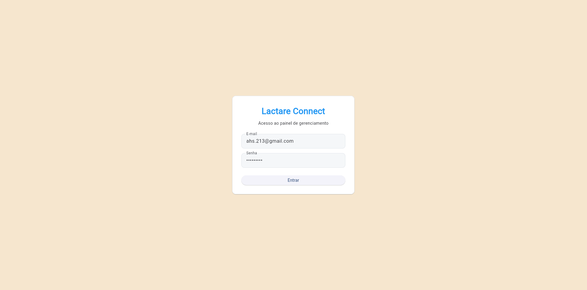
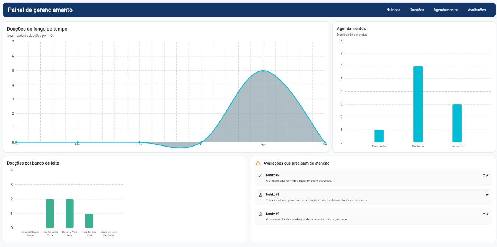
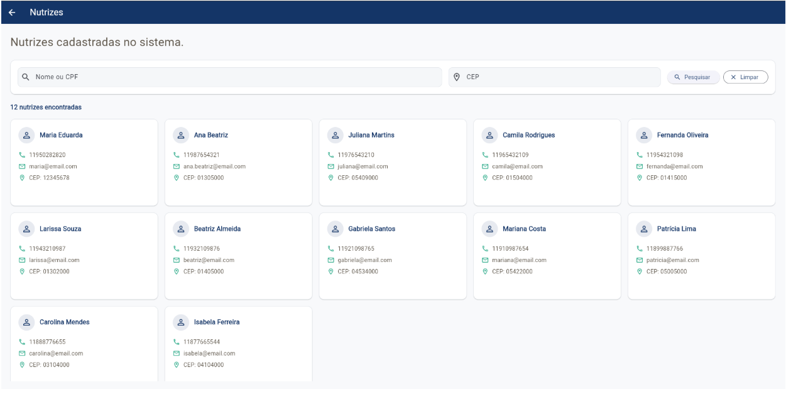
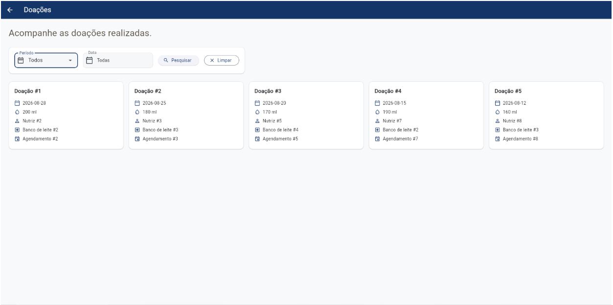
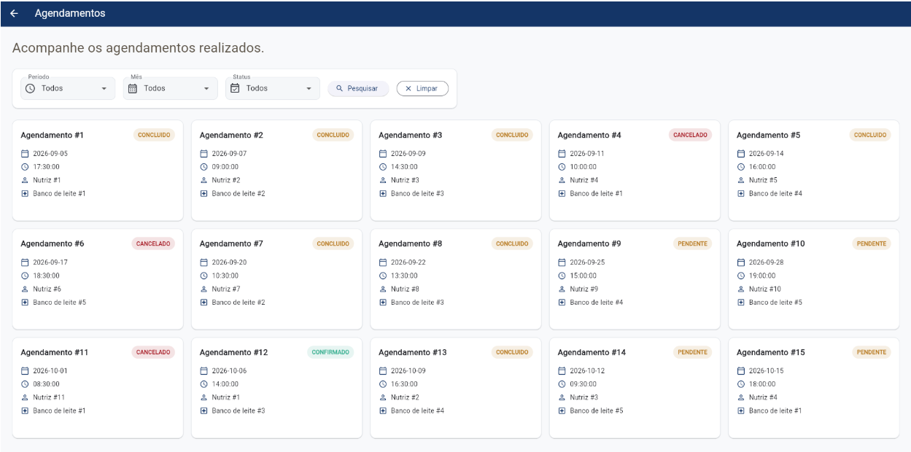
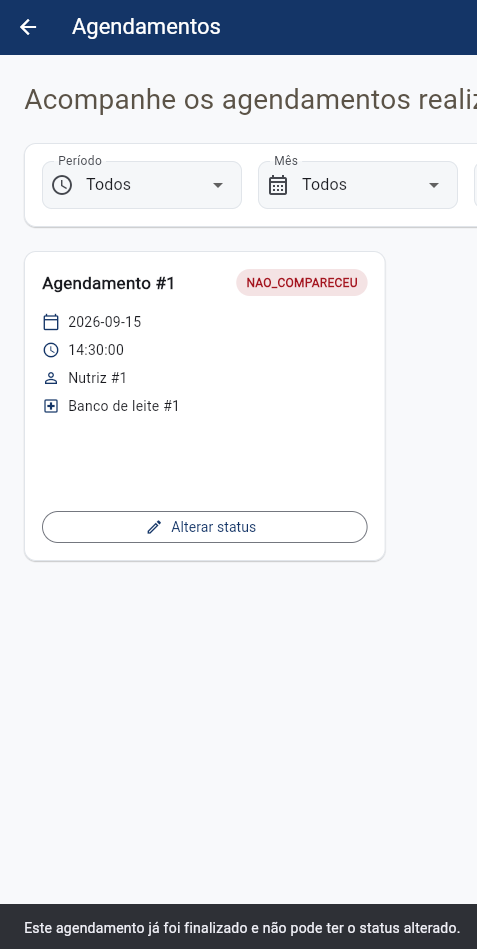
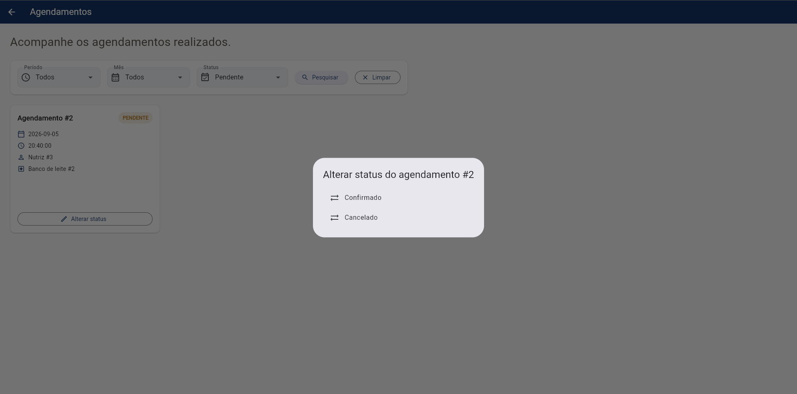
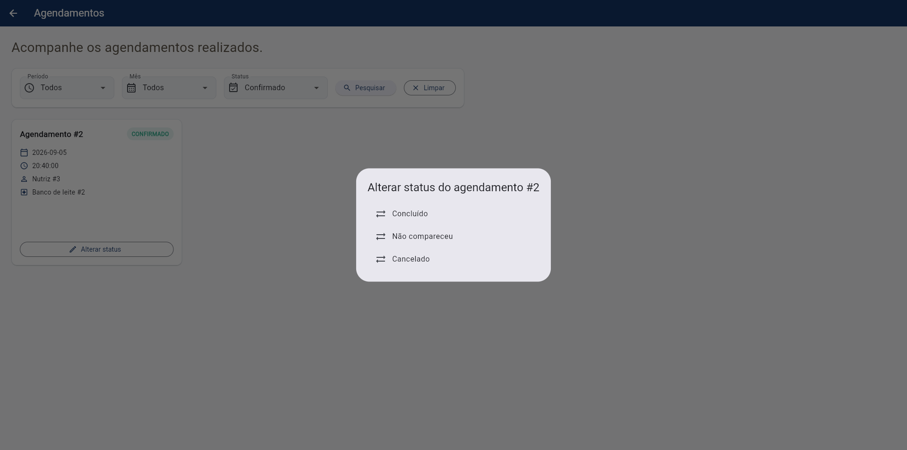
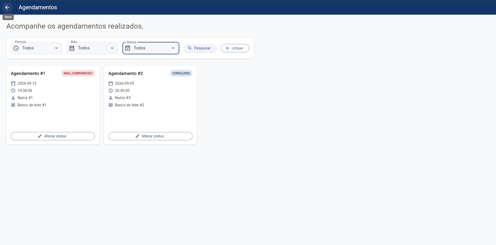
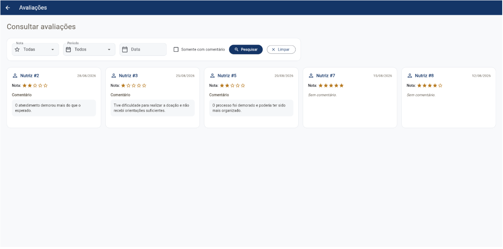

# Lactare Connect — Gestão

Aplicação web desenvolvida em Flutter para o gerenciamento do sistema Lactare, permitindo o acompanhamento de nutrizes, doações, agendamentos e avaliações de satisfação.

A aplicação possui integração com uma API REST desenvolvida em Java com Spring Boot, responsável pelo acesso e gerenciamento dos dados.

---

## Objetivo

O objetivo da aplicação é fornecer uma interface de gerenciamento para os responsáveis pelos Bancos de Leite, permitindo visualizar informações do sistema e acompanhar indicadores importantes.

A aplicação permite:

* Visualizar o dashboard de gerenciamento;
* Consultar nutrizes cadastradas;
* Consultar doações realizadas;
* Consultar agendamentos;
* Filtrar agendamentos por mês, período e status;
* Alterar o status dos agendamentos;
* Consultar avaliações de satisfação;
* Identificar avaliações que precisam de atenção;
* Realizar login com validação dos campos;
* Manter a sessão do usuário localmente.

---

## Tecnologias utilizadas

* Flutter
* Dart
* Flutter Web
* HTTP
* SharedPreferences
* API REST
* Java
* Spring Boot

---

## Projetos relacionados

Este projeto faz parte do sistema Lactare e utiliza uma API REST desenvolvida em Java com Spring Boot.

### Frontend — Gestão Lactare

Aplicação web desenvolvida em Flutter para gerenciamento de nutrizes, doações, agendamentos e avaliações.

**Repositório:**
https://github.com/AJ-Gonzales/gestao-lactare-flutter

### Backend — Lactare API

API REST desenvolvida em Java com Spring Boot, responsável pelo gerenciamento e disponibilização dos dados utilizados pela aplicação Flutter.

**Repositório:**
https://github.com/AJ-Gonzales/LactareAPI

### Comunicação entre os projetos

```text
Gestão Lactare (Flutter Web)
          │
          │ HTTP / REST
          ↓
     Lactare API
   (Java + Spring Boot)
          │
          ↓
     Banco de Dados
```

Durante o desenvolvimento local, a API é executada em:

```text
http://localhost:8080/api/v1
```

A aplicação Flutter precisa estar com a API em execução para realizar as consultas e operações de atualização de dados.

---

## Arquitetura do projeto

O projeto foi organizado separando as responsabilidades entre telas, modelos, serviços, componentes, tema e navegação.

```text
lib/
│
├── model/
│   ├── agendamento.dart
│   ├── banco_de_leite.dart
│   ├── doacao.dart
│   ├── nutriz.dart
│   └── pesquisa_satisfacao.dart
│
├── service/
│   ├── api_service.dart
│   ├── agendamento_service.dart
│   ├── banco_leite_service.dart
│   ├── doacao_service.dart
│   ├── nutriz_service.dart
│   └── pesquisa_satisfacao_service.dart
│
├── navigation/
│   ├── app_navigation.dart
│   └── app_routes.dart
│
├── theme/
│   └── app_colors.dart
│
└── ui/
    ├── components/
    └── screens/
```

### Models

Os Models representam os dados recebidos da API e possuem métodos `fromJson()` para transformar as respostas JSON em objetos Dart.

Exemplos:

* `Nutriz`
* `Agendamento`
* `Doacao`
* `BancoDeLeite`
* `PesquisaSatisfacao`

### Services

Os Services são responsáveis pela comunicação com a API REST.

O `ApiService` centraliza as requisições HTTP, enquanto os demais Services trabalham com os dados específicos de cada recurso.

Exemplos:

* `NutrizService`
* `AgendamentoService`
* `DoacaoService`
* `BancoLeiteService`
* `PesquisaSatisfacaoService`

### Screens

As Screens representam as páginas da aplicação:

* Login
* Dashboard
* Nutrizes
* Doações
* Agendamentos
* Avaliações

### Components

Os componentes reutilizáveis são utilizados principalmente no Dashboard, incluindo gráficos, menu de navegação e cards de alerta.

---

## Integração com a API REST

A aplicação consome uma API REST desenvolvida em Java com Spring Boot.

A URL base utilizada durante o desenvolvimento é:

```text
http://localhost:8080/api/v1
```

A configuração está centralizada no arquivo:

```text
lib/service/api_service.dart
```

### Endpoints utilizados

| Recurso         | Método | Endpoint                    | Utilização               |
| --------------- | ------ | --------------------------- | ------------------------ |
| Nutrizes        | GET    | `/nutrizes`                 | Consulta nutrizes        |
| Nutrizes        | GET    | `/nutrizes/{id}`            | Consulta uma nutriz      |
| Bancos de Leite | GET    | `/bancos-de-leite`          | Consulta bancos de leite |
| Doações         | GET    | `/doações`                  | Consulta doações         |
| Agendamentos    | GET    | `/agendamentos`             | Consulta agendamentos    |
| Agendamento     | PATCH  | `/agendamentos/{id}/status` | Atualiza o status        |
| Pesquisas       | GET    | `/pesquisas`                | Consulta avaliações      |

### Atualização de status

A aplicação também realiza uma operação de escrita na API através do método `PATCH`.

O usuário pode alterar o status de um agendamento conforme as regras definidas pela API.

Exemplo:

```text
PATCH /api/v1/agendamentos/2/status?status=CONFIRMADO
```

As transições permitidas são:

```text
PENDENTE
   ├── CONFIRMADO
   └── CANCELADO

CONFIRMADO
   ├── CONCLUIDO
   ├── NAO_COMPARECEU
   └── CANCELADO
```

Agendamentos finalizados não podem ter o status alterado.

---

## Configuração de CORS

Como a aplicação é executada como Flutter Web e a API Spring Boot é executada em outra origem/porta, foi configurado CORS na API para permitir a comunicação entre o frontend e o backend.

A configuração permite as requisições utilizadas pela aplicação, incluindo:

* GET
* PATCH
* OPTIONS

Durante o desenvolvimento local, a aplicação Flutter é executada no navegador e a API utiliza a porta `8080`.

---

## Formulários e validação

A tela de login possui um formulário utilizando `Form` e `GlobalKey<FormState>`.

Os campos são validados antes da tentativa de acesso ao sistema.

A validação impede o envio de campos obrigatórios vazios e apresenta mensagens ao usuário quando os dados são inválidos.

### Fluxo de validação

```text
Usuário preenche o formulário
          ↓
      Validação
          ↓
   ┌──────┴──────┐
   │             │
Inválido        Válido
   │             │
Mensagem        Login
de erro           ↓
              Dashboard
```

---

## Persistência local

A aplicação utiliza o pacote `shared_preferences` para armazenar localmente o estado de login.

Após o login, é armazenada a informação:

```text
usuario_logado = true
```

Ao iniciar a aplicação, a Splash Screen verifica essa informação.

### Fluxo de autenticação

```text
                    Início
                      ↓
                Splash Screen
                      ↓
             Verifica a sessão
                      ↓
             ┌────────┴────────┐
             │                 │
           Logado          Não logado
             │                 │
             ↓                 ↓
         Dashboard           Login
```

Ao realizar logout, a informação de sessão é removida e o usuário retorna para a tela de login.

---

## Tratamento de erros e carregamento

As telas que realizam consultas à API apresentam estados diferentes durante a comunicação.

### Carregamento

Enquanto os dados estão sendo buscados, é exibido um indicador de carregamento.

### Erro

Caso a comunicação com a API falhe, a aplicação apresenta uma mensagem informando que os dados não puderam ser carregados.

### Operações

Após uma alteração de status de agendamento, a aplicação apresenta uma mensagem de sucesso.

Caso a operação falhe, uma mensagem de erro é apresentada ao usuário.

---

# Telas da aplicação

## Login

Tela responsável pelo acesso ao sistema.

Possui:

* Campo de usuário;
* Campo de senha;
* Validação dos campos;
* Persistência da sessão;
* Redirecionamento para o Dashboard.

### Screenshot

>

---

## Dashboard

Tela principal do sistema de gerenciamento.

Apresenta informações resumidas por meio de componentes visuais, incluindo:

* Gráfico de doações;
* Gráfico de agendamentos;
* Informações dos Bancos de Leite;
* Alertas relacionados às avaliações de satisfação.

### Screenshot

>


---

## Nutrizes

Tela responsável pela consulta das nutrizes cadastradas no sistema.

Os dados são obtidos através da API REST.

### Screenshot

>

---

## Doações

Tela responsável pela visualização das doações registradas.

Os dados são carregados através do endpoint de doações da API.

### Screenshot

>

---

## Agendamentos

Tela responsável pelo acompanhamento dos agendamentos.

Possui filtros por:

* Período;
* Mês;
* Status.

Também permite alterar o status dos agendamentos através da API.

As alterações respeitam as regras de transição de status definidas no backend.

### Screenshot

>

### Filtros

>

### Alteração de status

>
>
>

---

## Avaliações

Tela responsável pela consulta das pesquisas de satisfação realizadas pelas nutrizes.

As avaliações abaixo de 3 estrelas são consideradas avaliações que precisam de atenção e podem apresentar comentários para auxiliar no acompanhamento do atendimento.

### Screenshot

> 

---

# Navegação

O fluxo principal da aplicação é:

```text
                    ┌──────────────┐
                    │    Splash    │
                    └──────┬───────┘
                           │
                 ┌─────────┴─────────┐
                 │                   │
             Logado              Não logado
                 │                   │
                 ↓                   ↓
          ┌────────────┐       ┌───────────┐
          │ Dashboard  │       │   Login   │
          └─────┬──────┘       └─────┬─────┘
                │                    │
                └────────┬───────────┘
                         ↓
                  ┌──────────────┐
                  │  Dashboard   │
                  └──────┬───────┘
                         │
       ┌─────────┬───────┼────────┬────────────┐
       ↓         ↓       ↓        ↓            ↓
   Nutrizes   Doações  Agenda-  Avaliações    Sair
                       mentos
```

As rotas da aplicação são centralizadas no arquivo `AppRoutes`.

---

# Como executar o projeto

## Pré-requisitos

É necessário possuir instalado:

* Flutter SDK;
* Dart SDK;
* Git;
* Google Chrome ou outro navegador compatível com Flutter Web;
* Java/JDK para executar a API;
* API Lactare configurada e em execução.

> A execução da API e a configuração do banco de dados estão documentadas no repositório do backend.

---

## 1. Executar a API

Primeiramente, clone e execute o projeto da API REST:

```bash
git clone https://github.com/AJ-Gonzales/LactareAPI.git
```

Entre na pasta:

```bash
cd LactareAPI
```

Execute a aplicação Spring Boot conforme as instruções do README do backend.

A API deverá estar disponível em:

```text
http://localhost:8080/api/v1
```

---

## 2. Clonar o projeto Flutter

Em outro terminal, clone o projeto:

```bash
git clone https://github.com/AJ-Gonzales/gestao-lactare-flutter.git
```

Entre na pasta:

```bash
cd gestao-lactare-flutter
```

---

## 3. Instalar as dependências

Execute:

```bash
flutter pub get
```

---

## 4. Configurar a API

A URL base da API está definida no arquivo:

```text
lib/service/api_service.dart
```

Atualmente:

```dart
static const String baseUrl = 'http://localhost:8080/api/v1';
```

Caso a API esteja sendo executada em outro endereço ou porta, essa configuração deverá ser alterada.

---

## 5. Executar a aplicação

Execute:

```bash
flutter run -d chrome
```

A aplicação será aberta no navegador.

A API Java deve permanecer em execução enquanto a aplicação Flutter estiver sendo utilizada.

---

# Testes funcionais realizados

Foram realizados testes de integração entre o Flutter e a API REST, incluindo:

* Consulta de nutrizes;
* Consulta de doações;
* Consulta de agendamentos;
* Consulta de avaliações;
* Consulta de Bancos de Leite;
* Atualização de status de agendamento através de `PATCH`;
* Validação do formulário de login;
* Persistência do login;
* Logout;
* Tratamento de erros durante requisições;
* Filtros de agendamentos;
* Feedback visual após operações.

---

# Estrutura do repositório

```text
gestao-lactare-flutter/
│
├── lib/
├── test/
├── assets/
├── pubspec.yaml
├── pubspec.lock
└── README.md
```

---

# Integrantes

* Anna Julia Bobrzyk Gonzales — RM: 557473
* Carlos Henrique Miranda Villarinho — RM: 558073
* Juliana Tami Kanashiro — RM: 558421

---

# Repositórios

### Gestão Lactare — Flutter

https://github.com/AJ-Gonzales/gestao-lactare-flutter

### Lactare API — Java / Spring Boot

https://github.com/AJ-Gonzales/LactareAPI

---

## Projeto acadêmico

Projeto desenvolvido para a Eurofarma como parte das atividades acadêmicas do curso de Sistemas de Informação.
